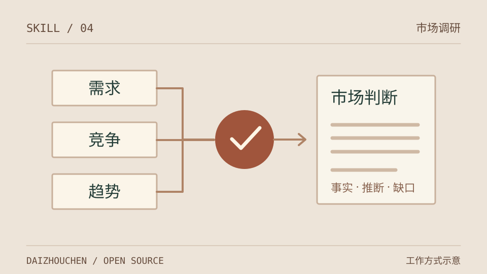

# Market Research · 市场研究



根据已配置的数据源规划市场调研，结合趋势、竞品、定价和用户反馈，输出可追溯的 Markdown / HTML 报告。需要可用浏览器时，也可导出 PDF。

这是 AI 助手执行的 Skill，附带数据采集和分析脚本；策略引擎生成计划，不会独立完成一份研究报告。

## 能力与数据源

| 数据来源 | 当前用途 | 前提 |
|---|---|---|
| Google Trends | 相对搜索热度 | `pytrends`，无需密钥；可能限流 |
| App Store / Google Play | 应用信息与竞争分析 | 公共接口或 scraper；受地区和访问状态影响 |
| Reddit 公开搜索辅助 | 生成搜索查询 | 助手具备网页搜索能力 |
| Reddit / Product Hunt | 讨论与产品信息 | 已配置并获授权的 API 凭据 |
| Amazon / SimilarWeb / Crunchbase | 商品、流量与公司信息 | 对应账号权限和 API 额度；Amazon 适配器为简化实现 |

无需密钥的数据源可作为起点，但不保证每次能返回数据。配置检查仅判断字段是否齐全，不验证权限或网络连通性。

## 安装

需要支持本地 Skills 的 AI 助手、Git 和 **Python 3.10+**。

Claude Code 个人安装（macOS / Linux）：

```bash
mkdir -p ~/.claude/skills
git clone https://github.com/daizhouchen/market-research-skill.git ~/.claude/skills/market-research
cd ~/.claude/skills/market-research
python -m pip install -r requirements.txt
cp config/config.example.yaml config/config.yaml
```

Windows PowerShell：

```powershell
git clone https://github.com/daizhouchen/market-research-skill.git "$env:USERPROFILE/.claude/skills/market-research"
Set-Location "$env:USERPROFILE/.claude/skills/market-research"
python -m pip install -r requirements.txt
Copy-Item config/config.example.yaml config/config.yaml
```

保持需密钥的数据源为 `enabled: false`，有相应授权后再在本地配置。不要把密钥写进报告或提交到仓库。

仓库根目录是直接安装入口；`skills/market-research/` 是 Claude 插件打包副本，两者保持同步，选择一种安装方式即可。插件方式使用副本内的 `config/`；依赖仍从仓库根目录的 `requirements.txt` 安装。

## 使用

“用 market-research 分析智能手表市场，目标地区为新加坡，先给快速摘要。”

在安装目录中检查配置并生成计划：

```bash
python tools/config_loader.py
python tools/strategy_engine.py --keyword "智能手表" --geo sg
```

助手按计划采集数据、记录失败与缺口，再写报告。导出已有报告：

```bash
python tools/report_exporter.py report.md --no-pdf
# 检测到 Edge / Chrome / Chromium 时可尝试同时生成 PDF
python tools/report_exporter.py report.md
```

Node.js 的 `app-store-scraper` 是可选增强；未安装时 App Store 模块回退到 iTunes Search API。

## 参考与边界

- [工作流](SKILL.md) · [配置模板](config/config.example.yaml) · [分析方法](references/analysis_framework.md) · [数据源规格](references/data_source_specs.md)
- 采集失败、缺失值和零值需要区分；无数据的维度保留缺口说明，不据此推断“没有需求”。
- Google Trends 是相对指数，不能直接当搜索人数或市场规模。TAM/SAM/SOM 脚本含假设，只能作为情景估算并披露输入口径。
- [examples/](examples/) 是已有报告示例，不是最新市场事实。

MIT License，见 [LICENSE](LICENSE)。

---
<!-- daizhouchen-footer-begin -->

Part of [**daizhouchen 实验集**](https://github.com/daizhouchen) → 一个 AI 应用创造者的实验现场。
<!-- daizhouchen-footer-end -->
